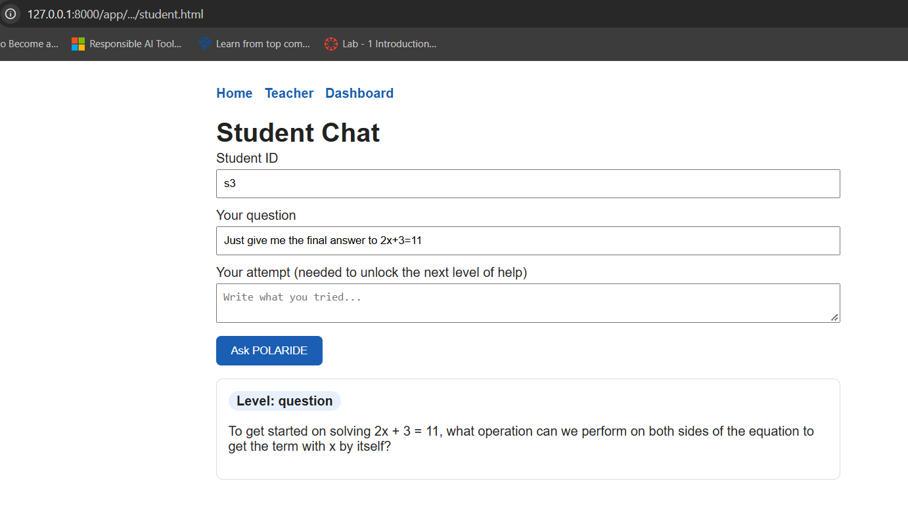
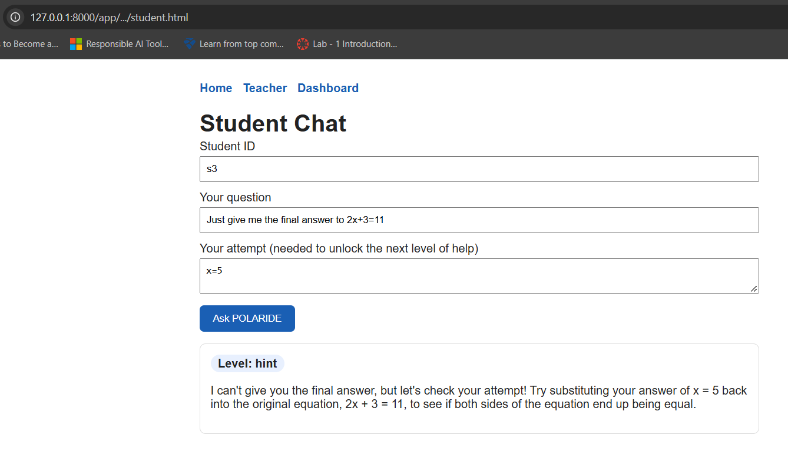
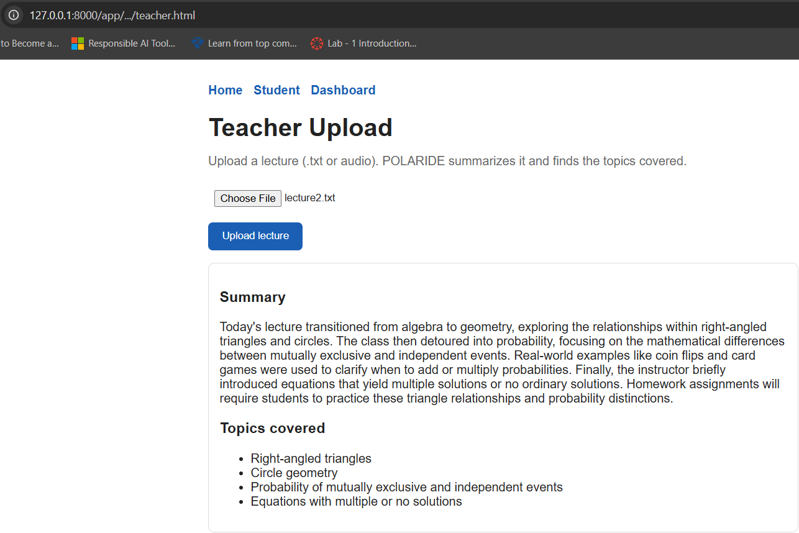
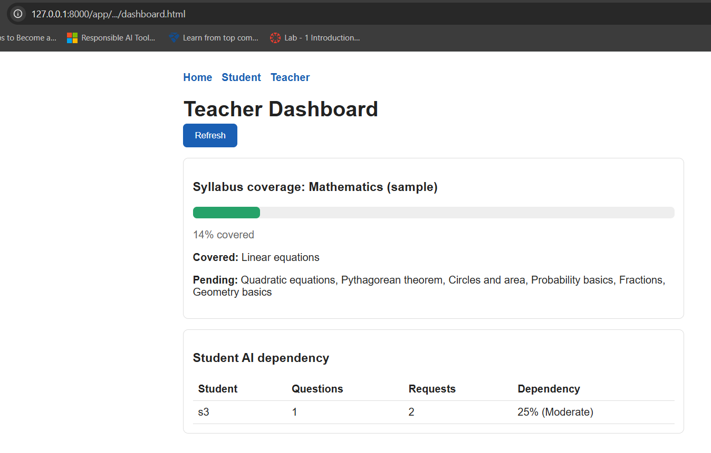

# POLARIDE — AI Guides. You Think. You Grow.

**Team:** Chaos to Code
**SIH 2026 Problem Statement:** SIH26224 — Student Innovation, Smart Education (Hardware category)

POLARIDE turns AI from an answer-giver into a learning guide. Instead of solving problems for students,
it escalates help through levels — Question → Hint → Step → Partial → Full — unlocking more help only
after the student attempts an answer. A second "Response Guard" check catches any reply that leaks too
much. On the teacher side, lecture recordings/text are auto-summarized into topics, tracked against the
syllabus, and used to ground the AI's guidance in what was actually taught in class.

This repo is the **software prototype** (hardware/classroom-mic components are out of scope here —
see the pitch deck for the full system).

## What's built here
- **Governor** — decides the help level per student per question; only escalates on a genuine attempt
- **Gemini integration** — generates guidance at exactly that level, grounded in class notes
- **Response Guard** — a second AI check that blocks/regenerates any reply that leaks the answer early
- **Lecture summarizer** — upload a lecture (text or audio) → auto-summary + extracted topics
- **Syllabus coverage tracker** — compares taught topics against the syllabus
- **AI-dependency dashboard** — flags students who lean on high-level help too often
- **3 web pages** — Student Chat, Teacher Upload, Teacher Dashboard

## Architecture
See `docs/architecture.png` (or the pitch deck) for the full Zone 1 (hardware) / Zone 2 (software) diagram.

## Tech stack
FastAPI · Google Gemini (`gemini-3.5-flash`) · vanilla HTML/JS · Python

## Setup & running locally

```bash
git clone https://github.com/JilledimudiCharan/polaride-prototype.git
cd polaride-prototype
python -m venv venv
.\venv\Scripts\Activate.ps1        # Windows PowerShell
pip install -r requirements.txt
```

Create a `.env` file (see `.env.example`):

Get a free key at https://aistudio.google.com/apikey
GEMINI_API_KEY=your_key_here

Run the server:
```bash
uvicorn backend.main:app --reload
```

Open **http://127.0.0.1:8000/app/**

## Demo walkthrough
1. Go to **Teacher** → upload `samples/lecture1.txt` (or `lecture2.txt` for a harder example)
2. Go to **Student** → ask a question with no attempt → note it only asks a guiding question
3. Submit an attempt → note the help level rises one step
4. Try demanding "just give me the answer" → note it still refuses to skip levels
5. Go to **Dashboard** → see syllabus coverage % and per-student AI-dependency scores

## Screenshots

| Refuses to skip levels | Escalates with attempt | Lecture summary | Dashboard |
|---|---|---|---|
|  |  |  |  |

## Known limitations (prototype scope)
- Data is stored in memory/JSON files, not a database — resets on server restart
- Syllabus list is a static file for the demo; planned: teachers upload their own syllabus,
  auto-extracted via Gemini and stored per subject
- Coverage matching uses simple text matching, not semantic similarity — teacher verification
  is the intended safeguard for mismatches
- Hardware components (classroom mic/device) are not part of this software prototype

## Team
Chaos to Code — Jilledimudi Charan
                Dhinesh Karthick P
                Sulaiha Safiya S
                Nithyiya Shree N
                Jecena Shree P
                Yogeshwari S